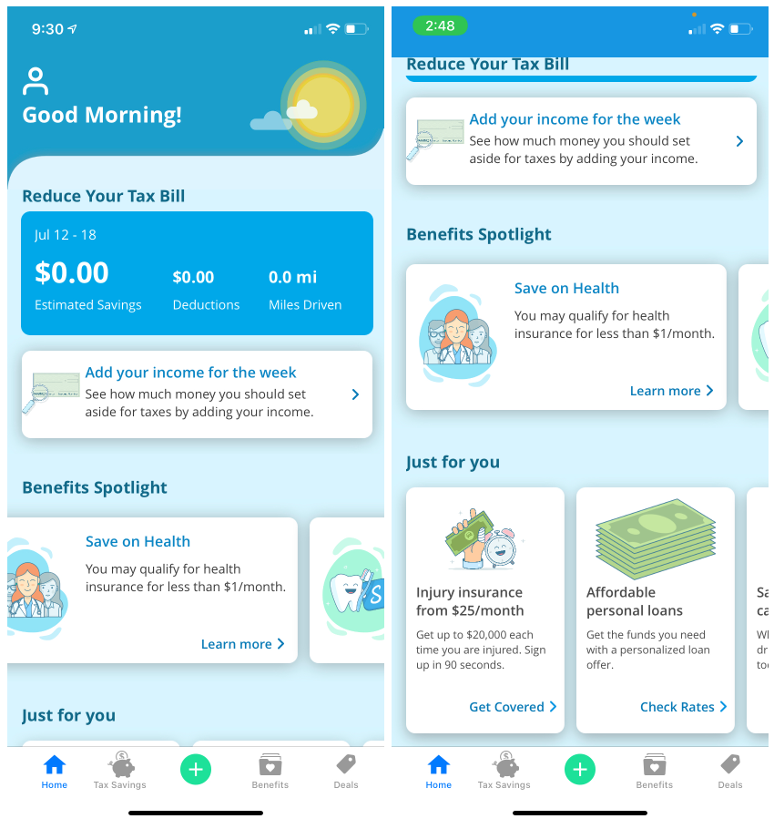

# StrideClone
Stride Health app home page clone(SwiftUI)

***App Demo***

***Production app screenshots(for reference)***

***Demo Highlights***

- Full recreation of all home screen elements
- All elements are reusable(no hard coded values) and populated with data obtained from a simulated API call
- Each benefit/deal card launches corresponding link in browser

***Code Highlights***

- Custom modifiers used to prevent repeated code(ex. HomeHeaderTextStyle)
- Custom shape created for the curvature header design
- MVVM architecture leveraging SwiftUI's @EnvironmentObject
- Heavy use of abstraction to prevent any view's body from getting too large and unreadable
